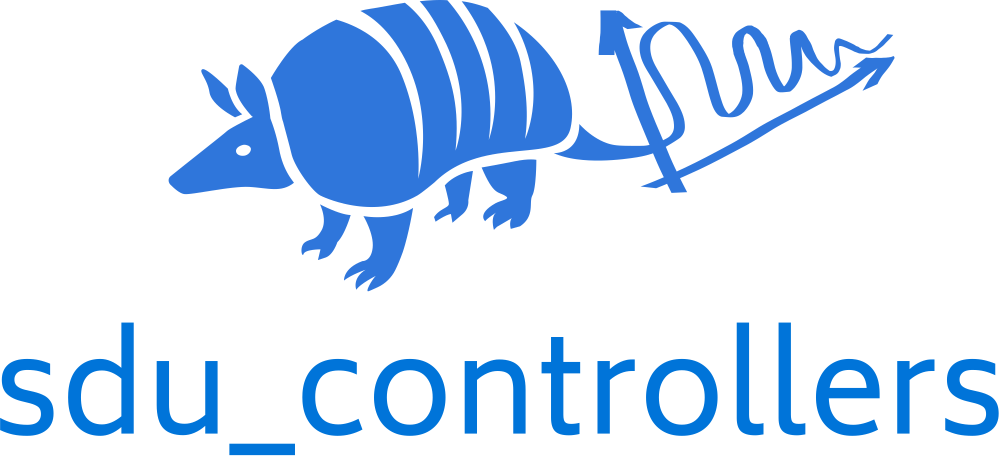

<p>
</p>
<div align="center">
    
</div>
<div align="center">
<p>
</p>

[](https://opensource.org/licenses/MIT)
[](https://github.com/SDU-Robotics/sdu_controllers/actions/workflows/ci.yml)
[](https://sdu-controllers.readthedocs.io/)
[](https://sonarcloud.io/summary/new_code?id=SDU-Robotics_sdu_controllers)
[](https://sonarcloud.io/summary/new_code?id=SDU-Robotics_sdu_controllers)
<!-- [](https://pypi.org/project/sdu_controllers) -->

</div>

# sdu_controllers

sdu_controllers is a C++ library that implements fundamental robot controllers.
The library is developed and maintained by the [SDU Robotics](https://www.sdu.dk/en/forskning/sdurobotics) group at University of Southern Denmark (SDU).
Python bindings and a MATLAB Simulink interface is provided making it possible to use it as a Python library or
in Simulink with very little overhead.

## Prerequisites

Building sdu_controllers requires the following software installed:

* A C++17-compliant compiler
* CMake `>= 3.9`
* Eigen3 `>= 3.3` for linear algebra.
* yaml-cpp for loading robot models.
* Doxygen (optional, documentation building is skipped if missing)
* Python `>= 3.8` for building Python bindings

## Building sdu_controllers

The following sequence of commands builds sdu_controllers.
It assumes that your current working directory is the top-level directory
of the freshly cloned repository:

``` bash
# if you plan to build tests or python bindings. Call this first
git submodule update --init --recursive

# normal build
mkdir build
cd build
cmake -DCMAKE_BUILD_TYPE=Release ..
cmake --build .
```

The build process can be customized with the following CMake variables,
which can be set by adding `-D<var>={ON, OFF}` to the `cmake` call:

* `BUILD_TESTING`: Enable building of the test suite (default: `ON`)
* `BUILD_DOCS`: Enable building the documentation (default: `ON`)
* `BUILD_PYTHON`: Enable building the Python bindings (default: `ON`)
* `BUILD_EXAMPLES`: Enable building the examples (default: `ON`)

For some controllers, hardware specific examples have been implemented which can be run on a real robot.
These are disabled by default.
* `BUILD_UR_EXAMPLES`: Enable building UR specific examples (default: `OFF`)

If you wish to build and install the project as a Python project without
having access to C++ build artifacts like libraries and executables, you
can do so using `pip` from the root directory:

```
python -m pip install .
```

## Testing sdu_controllers

When built according to the above explanation (with `-DBUILD_TESTING=ON`),
the C++ test suite of `sdu_controllers` can be run using
`ctest` from the build directory:

```
cd build
ctest
```

The Python test suite can be run by first `pip`-installing the Python package
and then running `pytest` from the top-level directory:

```
python -m pip install .
pytest
```

## Documentation

sdu_controllers provides a Sphinx-based documentation, that can
be browsed [online at readthedocs.org](https://sdu-controllers.readthedocs.io).
To build it locally, first ensure the requirements are installed by running this command from the top-level source directory:

```
pip install -r doc/requirements.txt
```

Then build the sphinx documentation from the top-level build directory:

```
cmake --build . --target sphinx-doc
```

The web documentation can then be browsed by opening `doc/sphinx/index.html` in your browser.
