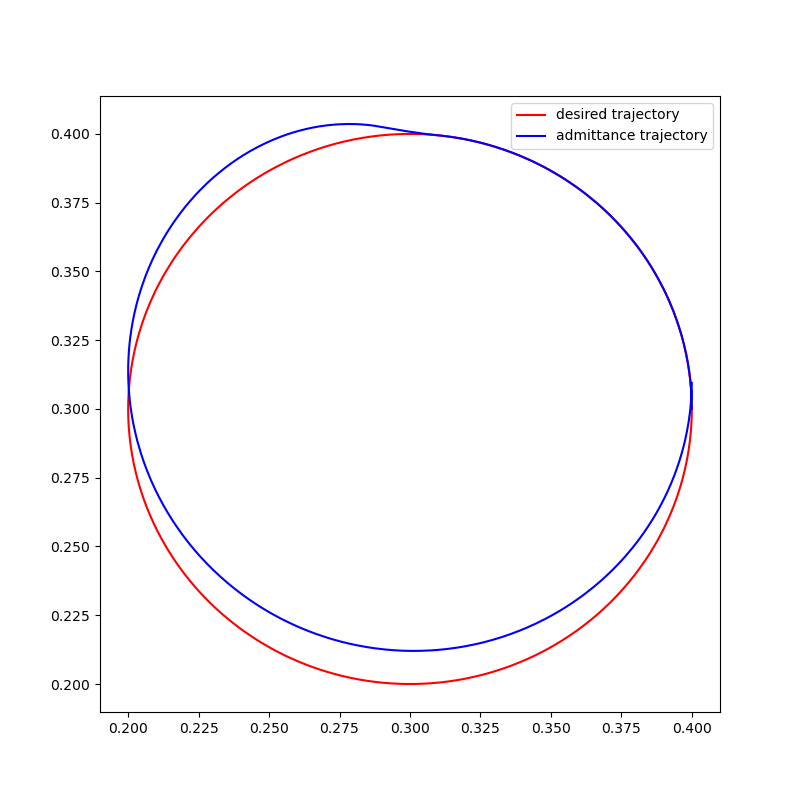

.. _examples:

********
Examples
********

This section contains examples which demonstrate the usage of the different controllers.
We've implemented both general and robot specific examples.
To build the robot specific examples, see :ref:`installation`.

Admittance controller:

* :ref:`General example<admittance-controller-example>`
* :ref:`Circle example (UR)<admittance-circle-ur-example>`
* :ref:`Kinesthetic teaching example (UR) <kinesthetic-teaching-ur-example>`

The examples are available in C++ and Python.

Admittance Controller
=====================

.. _admittance-controller-example:

General example
---------------

This example demonstrates the general usage of the admittance controller and shows how it reacts to a force disturbance.

The reference trajectory (red) is a single circle in the xy plane starting at (0.4, 0.3) and moves counter clockwise.
The controller is following this trajectory, when at (0.3, 0.4) a force pointing in positive y is injected.
The reaction of the controller to this disturbance is plotted in blue.

The C++ code in this example generates the trajectories and writes them into a csv file.
They can then be plotted using the plot_trajectory.py script in the scripts/admittance_controller folder.

.. _admittance-circle-ur-example:

Circle example (UR)
-------------------
This example demonstrates how to implement an admittance control on a UR which follows a specific trajectory
while being compliant to disturbances at the end-effector.
The desired trajectory is a circle starting at the current location of the robot. The robot will move follow that circle and
return to it when it is disturbed by a force.
How quickly and forceful it returns to the trajectory is regulated by the positional gain.
The damping is typically set to be critically damped to ensure controller stability.

.. note::
    Remember to set the payload of the robot properly.

.. _kinesthetic-teaching-ur-example:

Kinesthetic teaching example (UR)
---------------------------------
This example shows how the admittance controller can be used for kinesthetic teaching on a UR, meaning that a user
can easily move the robot around by grabbing it at the end-effector.
This is achieved by setting the positional and orientational gain to zero,
which results in compliant behavior without any forces pulling the robot back to position / trajectory.
The damping regulates the sensitivity to the input forces and torques.

.. note::
    Remember to set the payload of the robot properly.