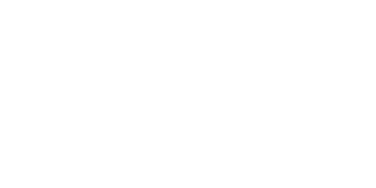

.. _cartesian_motion_control:

************************
Cartesian motion control
************************
sdu_controllers implements a Cartesian (operational-space) motion controller with inverse
dynamics control, as described on page 348 in :cite:t:`2009:Siciliano`, via the
:ref:`OperationalSpaceController <operational-space-controller-api>` class.

Unlike the :ref:`joint-space motion controller <joint_space_motion_control>`, the desired
trajectory here is defined directly in Cartesian (task) space - a position and orientation
of the end-effector - rather than in joint space. The controller inverts the task-space
dynamics (using a damped least-squares pseudo-inverse of the Jacobian, see
:ref:`Explanation <explanation-osc>`) to compute the joint accelerations needed to track it.

Orientation representation
===========================
The controller supports two interchangeable orientation representations, selected via the
:code:`orientation_rep` constructor argument:

* **ZYZ** (default) - uses the analytical Jacobian and a ZYZ Euler-angle orientation error.
  Simple to reason about, but singular at :math:`\theta = 0` and :math:`\theta = \pi`.
* **QUATERNION** - uses the geometric Jacobian and a unit-quaternion orientation error.
  Singularity-free, at the cost of a slightly less direct mapping between gains and
  Euler-angle axes.

Redundancy resolution
======================
For manipulators with more than 6 actuated joints (e.g. the 7-DOF breeding blanket handling
robot), the controller performs null-space redundancy resolution: the primary Cartesian
tracking task is projected through the pseudo-inverse of the Jacobian, and any remaining
null-space freedom is used to damp joint velocity drift via :code:`set_Kd_null()`.

Example: tracking a Cartesian circle (UR5e)
=============================================
This example drives a UR5e along a circle in the XY plane using the shared
:ref:`circular trajectory helper <how-to-generate-circular-trajectory>`, in ZYZ mode.
The code is available under

:code:`examples/simulation/ur/cpp/cartesian_motion_controller.cpp`

or

:code:`examples/simulation/ur/python/cartesian_motion_controller.py`.

.. tabs::

   .. code-tab:: c++

        #include <common/trajectory_generation.hpp>
        #include <sdu_controllers/controllers/operational_space_controller.hpp>
        #include <sdu_controllers/models/ur_robot_model.hpp>

        auto robot_model = std::make_shared<models::URRobotModel>(models::URRobotModel::RobotType::ur5e);

        MatrixXd Kp = MatrixXd::Zero(6, 6);
        Kp.block<3, 3>(0, 0) = MatrixXd::Identity(3, 3) * 16250.0;  // position stiffness
        Kp.block<3, 3>(3, 3) = MatrixXd::Identity(3, 3) * 16250.0;  // orientation stiffness
        MatrixXd Kd = MatrixXd::Zero(6, 6);
        Kd.block<3, 3>(0, 0) = MatrixXd::Identity(3, 3) * 200.0;
        Kd.block<3, 3>(3, 3) = MatrixXd::Identity(3, 3) * 3.0;

        // ZYZ mode (default): x_d is [position(3), ZYZ angles(3)].
        controllers::OperationalSpaceController osc_controller(Kp, Kd, robot_model);

        // ... in the control loop, at time t:
        Vector3d pos_d, dpos_d, ddpos_d;
        examples::circular_trajectory(center, radius, omega, t, ramp_time, pos_d, dpos_d, ddpos_d);

        VectorXd x_d(6), dx_d(6), ddx_d(6);
        x_d << pos_d, rot_zyz_d;       // orientation held constant at the start pose
        dx_d << dpos_d, Vector3d::Zero();
        ddx_d << ddpos_d, Vector3d::Zero();

        osc_controller.step(x_d, dx_d, ddx_d, q, dq);
        VectorXd y = osc_controller.get_output();      // joint accelerations
        VectorXd tau = robot_model->inverse_dynamics(q, dq, y, he);

   .. code-tab:: py

        import sdu_controllers
        from trajectory_generation import circular_trajectory

        robot_model = sdu_controllers.models.URRobotModel(sdu_controllers.models.RobotType.ur5e)

        Kp = np.eye(6)
        Kp[0:3, 0:3] = np.eye(3) * 16250.0
        Kp[3:6, 3:6] = np.eye(3) * 16250.0
        Kd = np.eye(6)
        Kd[0:3, 0:3] = np.eye(3) * 200.0
        Kd[3:6, 3:6] = np.eye(3) * 3.0

        # ZYZ mode (default): x_d is [position(3), ZYZ angles(3)].
        controller = sdu_controllers.controllers.OperationalSpaceController(Kp, Kd, robot_model)

        # ... in the control loop, at time t:
        pos_d, dpos_d, ddpos_d = circular_trajectory(center, radius, omega, t, ramp_time)
        x_d = np.concatenate([pos_d, rot_zyz_d])
        dx_d = np.concatenate([dpos_d, np.zeros(3)])
        ddx_d = np.concatenate([ddpos_d, np.zeros(3)])

        controller.step(x_d, dx_d, ddx_d, q, dq)
        y = controller.get_output()
        tau = robot_model.inverse_dynamics(q, dq, y, he)

To use the QUATERNION representation instead, pass
:code:`controllers::OperationalSpaceController::OrientationRepresentation::QUATERNION`
(C++) or :code:`sdu_controllers.controllers.OrientationRepresentation.QUATERNION` (Python)
as the constructor's :code:`orientation_rep` argument, and supply :code:`quat_d` to
:code:`step()` - see the :ref:`Impedance control <impedance_control>` tutorial for a
worked QUATERNION-mode example (the two controllers share the same orientation math).

.. seealso::
   :ref:`Visualize a trajectory with Viser <how-to-visualize-viser>` to turn the logged
   output into a short video of the robot motion.
