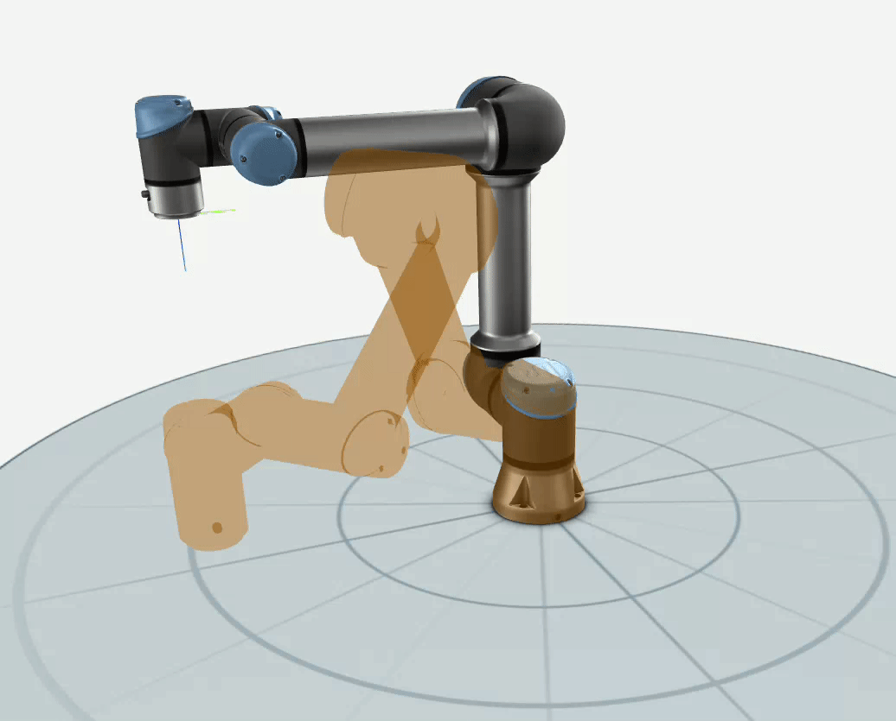
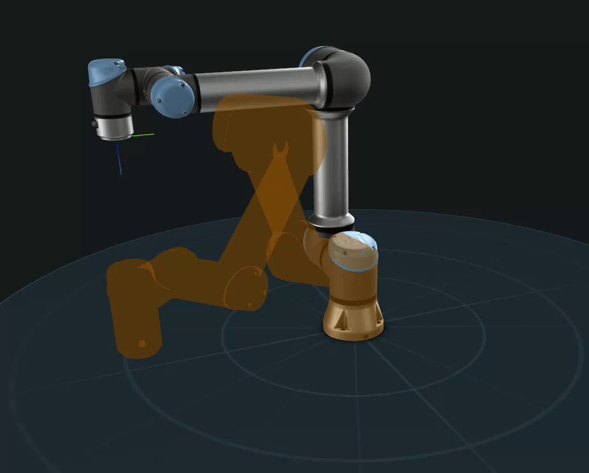

.. _getting-started:

***************
Getting started
***************

To get started with using sdu_controllers, you first need to install it on your system. See
:ref:`Installation <installation>`.

First steps (defining a trajectory)
===================================
To run the :ref:`joint-space motion controller <joint_space_motion_control>` in sdu_controllers, with the
EUROfusion breeding blanket handling robot, you can use the pre-defined trajectory under:

.. code-block:: bash

    examples/data/joint_trajectory_safe_bb.csv

which defines a trajectory that simulates the robot moving down into the vacuum vessel of the fusion reactor for
breeding blanket removal. If you do not need a trajectory for the UR5e robot simply skip to next section with the
:ref:`joint-space motion controller <joint_space_motion_control>`.

If you want to try :ref:`joint-space motion controller <joint_space_motion_control>` on a
Universal Robots UR5e a trajectory must be generated first. Simply choose two arbitrary joint positions. In
this example the robot is moved from the joint position :math:`q_{start}` defined as:

.. math::

   q_{start} = [0^{\circ}, -90^{\circ}, -90^{\circ}, -90^{\circ}, 90^{\circ}, 0^{\circ}]

to the joint position :math:`q_{final}` defined as:

.. math::

   q_{final} = [45^{\circ}, -120^{\circ}, -90^{\circ}, -60.0^{\circ}, 90^{\circ}, -45^{\circ}]

You can then run the provided Python script under :code:`scripts/generate_joint_trajectory.py` to generate
the joint trajectory like this:

.. code-block:: bash

   cd scripts
   python3 generate_joint_trajectory.py

.. note::
   The :code:`generate_joint_trajectory.py` Python script is using the :code:`jtraj()` function from the Robotics
   toolbox for Python by :cite:t:`2021:Corke`, which uses a quintic (5th order) polynomial to create a smooth
   joint trajectory.

After running the script, the trajectory is available under :code:`examples/data/joint_trajectory_safe.csv`.
the trajectory should like like following on a UR5e manipulator:

With the trajectory generated we are now ready to run the joint-space motion control.