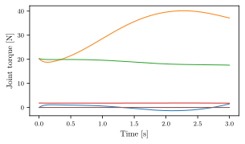
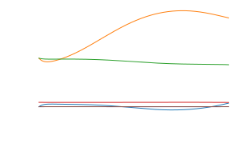

.. _getting-started:

***************
Getting started
***************

To get started with using sdu_controllers, you first need to install it on your system. See
:ref:`Installation <installation>`.

First steps (Joint-space motion control)
========================================
sdu_controllers implements a joint-space motion controller as described in :cite:t:`2009:Siciliano`. By using this controller you can make a
robot follow an arbitrary joint-space trajectory that is defined within the limits of the robots. In the first example we use
the Universal Robots UR5e 6 DOF robot manipulator, see also the example with the 7 DOF breeding blanket handling robot
here.

.. figure:: ../../_static/joint_motion_control.svg
   :width: 90%
   :class: only-light

.. figure:: ../../_static/joint_motion_control.svg
   :width: 90%
   :class: only-dark

Example with Universal Robots UR5e robot
========================================
First a trajectory must be generated. For the sake of the example we choose two arbitrary joint positions. In
this example the robot is moved from the joint position :math:`q_{start}` defined as:

.. math::

   q_{start} = [0^{\circ}, -90^{\circ}, -90^{\circ}, -90^{\circ}, 90^{\circ}, 0^{\circ}]

to the joint position :math:`q_{final}` defined as:

.. math::

   q_{final} = [45^{\circ}, -120^{\circ}, -90^{\circ}, -60.0^{\circ}, 90^{\circ}, -45^{\circ}]

You can run the provided script under :code:`scripts/generate_joint_trajectory.py` to generate
the joint trajectory like this:

.. code-block:: bash

   cd scripts
   python3 generate_joint_trajectory.py

The script is using the :code:`jtraj()` function
from the Robotics toolbox for Python by :cite:t:`2021:Corke`, which uses a quintic (5th order)
polynomial to create a smooth joint trajectory.

After running the script the trajectory is available under :code:`examples/data/joint_trajectory_safe.csv`.

With the trajectory generated we can now try to run the joint motion control. You can choose to make your own
example with a :code:`.cpp` or :code:`.py` file or feel free to simply use the one available under
:code:`examples/ur_examples/joint_motion_controller.cpp` or :code:`examples/ur_examples/python/joint_motion_controller.py`.

The code for joint-space motion control is listed here in C++ and Python:

.. tabs::

   .. code-tab:: c++

        #include <Eigen/Dense>
        #include <fstream>
        #include <iostream>
        #include <sdu_controllers/controllers/pd_controller.hpp>
        #include <sdu_controllers/math/inverse_dynamics_joint_space.hpp>
        #include <sdu_controllers/models/ur_robot.hpp>
        #include <sdu_controllers/models/ur_robot_model.hpp>
        #include <sdu_controllers/utils/utility.hpp>

        // Initialize robot model and parameters
        auto robot_model = std::make_shared<models::URRobotModel>(URRobot::RobotType::UR5e);
        double Kp_value = 1000.0; // Proportional gain
        double Kd_value = 2 * sqrt(Kp_value); // Derivative gain
        double N_value = 1; // Feed-forward gain
        uint16_t ROBOT_DOF = robot_model->get_dof();
        VectorXd Kp_vec = VectorXd::Ones(ROBOT_DOF) * Kp_value;
        VectorXd Kd_vec = VectorXd::Ones(ROBOT_DOF) * Kd_value;
        VectorXd N_vec = VectorXd::Ones(ROBOT_DOF) * N_value;

        controllers::PDController pd_controller(Kp_vec.asDiagonal(), Kd_vec.asDiagonal(), N_vec.asDiagonal());
        math::InverseDynamicsJointSpace inv_dyn_jnt_space(robot_model);

        VectorXd q_d(ROBOT_DOF);
        VectorXd dq_d(ROBOT_DOF);
        VectorXd ddq_d(ROBOT_DOF);

        VectorXd q(ROBOT_DOF);
        VectorXd dq(ROBOT_DOF);
        q << 0.0, -1.5707, -1.5707, -1.5707, 1.5707, 0.0;
        dq << 0.0, 0.0, 0.0, 0.0, 0.0, 0.0;

        // Read input trajectory from file
        std::vector<std::vector<double>> input_trajectory = get_trajectory_from_file("../../examples/data/joint_trajectory_safe.csv");

        // Control loop
        for (const std::vector<double>& trajectory_point : input_trajectory)
        {
          // Desired
          for (Index i = 0; i < q_d.size(); i++)
          {
            q_d[i] = trajectory_point[i];
            dq_d[i] = trajectory_point[i+ROBOT_DOF];
            ddq_d[i] = trajectory_point[i+(2*ROBOT_DOF)];
          }

          VectorXd q_meas = q;
          VectorXd dq_meas = dq;

          // Controller
          VectorXd u_ff = ddq_d; // acceleration as feedforward.
          // VectorXd u_ff = robot_model->get_gravity(q_meas); // feedforward with gravity compensation.
          pd_controller.step(q_d, dq_d, u_ff, q_meas, dq_meas);
          VectorXd y = pd_controller.get_output();
          VectorXd tau = inv_dyn_jnt_space.inverse_dynamics(y, q_meas, dq_meas);
          std::cout << "tau: " << tau << std::endl;
        }

   .. code-tab:: py

        import numpy as np
        from numpy import genfromtxt
        import sdu_controllers

        joint_traj = genfromtxt('examples/data/joint_trajectory_safe.csv', delimiter=',')
        Kp_val = 100.0  # Proportional gain
        Kd_val = 2 * np.sqrt(Kp_val) # Derivative gain
        N_val = 1 # Feed-forward gain

        Kp = np.diag([Kp_val, Kp_val, Kp_val, Kp_val, Kp_val, Kp_val])
        Kd = np.diag([Kd_val, Kd_val, Kd_val, Kd_val, Kd_val, Kd_val])
        N = np.diag([N_val, N_val, N_val, N_val, N_val, N_val])

        ur_robot = sdu_controllers.URRobotModel()
        pd_controller = sdu_controllers.PDController(Kp, Kd, N)
        inv_dyn_jnt_space = sdu_controllers.InverseDynamicsJointSpace(ur_robot)

        q = np.array([0.0, -1.5707, -1.5707, -1.5707, 1.5707, 0.0])
        dq = np.zeros(6)

        for joint_q in joint_traj:
            q_d = np.array(joint_q[0:6])
            dq_d = np.array(joint_q[6:12])
            ddq_d = np.array(joint_q[12:18])

            u_ff = ddq_d
            # u_ff = ur_robot.get_gravity(q_meas); // feedforward with gravity compensation.
            pd_controller.step(q_d, dq_d, u_ff, q, dq)
            y = pd_controller.get_output()
            tau = inv_dyn_jnt_space.inverse_dynamics(y, q, dq)
            print('tau:', tau)

You have to provide gains for the PD controller :math:`\mathbf{K}_{P}` and :math:`\mathbf{K}_{D}`
and optionally a feed-forward gain :math:`\mathbf{N}`.

If you plot the output joint torques tau, you should get something similar to the following figure:

Example with Breeding Blanket Handling Robot
============================================

.. tabs::

   .. code-tab:: c++

         int main(const int argc, const char **argv) {
           return 0;
         }

   .. code-tab:: py

         def main():
             return

see additional examples in the :ref:`Examples <examples>` section.