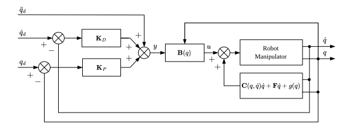
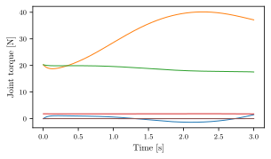
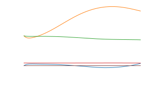

.. _joint_space_motion_control:

**************************
Joint-space motion control
**************************
sdu_controllers implements a joint-space motion controller with inverse dynamics control
as described on page 330 in :cite:t:`2009:Siciliano`. By using this controller you can make
a robot follow an arbitrary joint-space trajectory that is defined within the limits of
the robots. This page contains two examples, in the :ref:`first example <ur5e_joint_space_control>`
we use the Universal Robots UR5e 6 DOF robot manipulator and in the
:ref:`second example <bb_robot_joint_space_control>` the more advanced 7 DOF breeding
blanket handling robot.

The dynamic model of an n-joint robot
manipulator given by the Euler-Lagrange equation can be written as:

.. math::

   B(q)\ddot{q} + C(q, \dot{q})\dot{q} + F\dot{q} + g(q) = u

where :math:`B(q)` is the inertia tensor, :math:`C(q, \dot{q})` is a matrix containing
Coriolis and centrifugal terms, :math:`g(q)` is the gravity vector, and :math:`u` is the
actuator torque. By taking the control :math:`u` as a function of the manipulator state
in the form:

.. math::

   u = B(q)y + C(q, \dot{q})\dot{q} + F\dot{q} + g(q)

then the system can be described as

.. math::

   \ddot{q} = y

where :math:`y` is our auxiliary input signal.

We can then choose to have PD-control acting on the desired joint positions :math:`q_{d}` and joint velocities :math:`\dot{q}_{d}`
like the following:

.. math::

   y = u_{ff} + K_{P}(q_{d} - q) + K_{D}(\dot{q}_{d} - \dot{q})

here the acceleration is used as feed-forward :math:`u_{ff} = \ddot{q}`.

.. note::
    You can also choose the gravity vector as feed-forward so that :math:`u_{ff} = g(q)`,
    which will make the controller compensate the gravity forces.

.. _ur5e_joint_space_control:

UR5e robot joint-space control
------------------------------
With the trajectory generated we can now try to run the joint motion control. You can choose to make your own
example with a :code:`.cpp` or :code:`.py` file or feel free to simply use the one available under

:code:`examples/ur_examples/joint_motion_controller.cpp`

or

:code:`examples/ur_examples/python/joint_motion_controller.py`.

The code for joint-space motion control is listed here in C++ and Python:

.. tabs::

   .. code-tab:: c++

        #include <Eigen/Dense>
        #include <fstream>
        #include <iostream>
        #include <sdu_controllers/controllers/pd_controller.hpp>
        #include <sdu_controllers/math/inverse_dynamics_joint_space.hpp>
        #include <sdu_controllers/models/ur_robot.hpp>
        #include <sdu_controllers/models/ur_robot_model.hpp>
        #include <sdu_controllers/utils/utility.hpp>

        // Initialize robot model and parameters
        auto robot_model = std::make_shared<models::URRobotModel>(URRobot::RobotType::UR5e);
        double Kp_val = 1000.0; // Proportional gain
        double Kd_val = 2 * sqrt(Kp_value); // Derivative gain
        double N_val = 1; // Feed-forward gain
        uint16_t ROBOT_DOF = robot_model->get_dof();
        VectorXd Kp_vec = VectorXd::Ones(ROBOT_DOF) * Kp_val;
        VectorXd Kd_vec = VectorXd::Ones(ROBOT_DOF) * Kd_val;
        VectorXd N_vec = VectorXd::Ones(ROBOT_DOF) * N_val;

        controllers::PDController pd_controller(Kp_vec.asDiagonal(), Kd_vec.asDiagonal(), N_vec.asDiagonal());
        math::InverseDynamicsJointSpace inv_dyn_jnt_space(robot_model);

        VectorXd q_d(ROBOT_DOF);
        VectorXd dq_d(ROBOT_DOF);
        VectorXd ddq_d(ROBOT_DOF);

        VectorXd q(ROBOT_DOF);
        VectorXd dq(ROBOT_DOF);
        q << 0.0, -1.5707, -1.5707, -1.5707, 1.5707, 0.0;
        dq << 0.0, 0.0, 0.0, 0.0, 0.0, 0.0;

        // Read input trajectory from file
        std::vector<std::vector<double>> input_trajectory = get_trajectory_from_file("../../examples/data/joint_trajectory_safe.csv");

        // Control loop
        for (const std::vector<double>& trajectory_point : input_trajectory)
        {
          // Desired
          for (Index i = 0; i < q_d.size(); i++)
          {
            q_d[i] = trajectory_point[i];
            dq_d[i] = trajectory_point[i+ROBOT_DOF];
            ddq_d[i] = trajectory_point[i+(2*ROBOT_DOF)];
          }

          VectorXd q_meas = q;
          VectorXd dq_meas = dq;

          // Controller
          VectorXd u_ff = ddq_d; // acceleration as feedforward.
          // VectorXd u_ff = robot_model->get_gravity(q_meas); // feedforward with gravity compensation.
          pd_controller.step(q_d, dq_d, u_ff, q_meas, dq_meas);
          VectorXd y = pd_controller.get_output();
          VectorXd tau = inv_dyn_jnt_space.inverse_dynamics(y, q_meas, dq_meas);
          std::cout << "tau: " << tau << std::endl;
        }

   .. code-tab:: py

        import numpy as np
        from numpy import genfromtxt
        import sdu_controllers

        joint_traj = genfromtxt('examples/data/joint_trajectory_safe.csv', delimiter=',')
        Kp_val = 100.0  # Proportional gain
        Kd_val = 2 * np.sqrt(Kp_val) # Derivative gain
        N_val = 1 # Feed-forward gain

        Kp = np.diag([Kp_val, Kp_val, Kp_val, Kp_val, Kp_val, Kp_val])
        Kd = np.diag([Kd_val, Kd_val, Kd_val, Kd_val, Kd_val, Kd_val])
        N = np.diag([N_val, N_val, N_val, N_val, N_val, N_val])

        ur_robot = sdu_controllers.URRobotModel()
        pd_controller = sdu_controllers.PDController(Kp, Kd, N)
        inv_dyn_jnt_space = sdu_controllers.InverseDynamicsJointSpace(ur_robot)

        q = np.array([0.0, -1.5707, -1.5707, -1.5707, 1.5707, 0.0])
        dq = np.zeros(6)

        for joint_q in joint_traj:
            q_d = np.array(joint_q[0:6])
            dq_d = np.array(joint_q[6:12])
            ddq_d = np.array(joint_q[12:18])

            u_ff = ddq_d
            # u_ff = ur_robot.get_gravity(q_meas); // feedforward with gravity compensation.
            pd_controller.step(q_d, dq_d, u_ff, q, dq)
            y = pd_controller.get_output()
            tau = inv_dyn_jnt_space.inverse_dynamics(y, q, dq)
            print('tau:', tau)

You have to provide gains for the PD controller using the variables :code:`Kp_val` and :code:`Kd_val`
and optionally a feed-forward gain using the variable :code:`N_val`.

If you plot the output joint torques from the variable :code:`tau`, you should get something similar
to the following figure:

In order to check whether the output torques produces a robot movement that ressembles the input trajectory, a
simulation can be performed by using forward dynamics to calculate an output trajectory based on the output torques :math:`u`. This
output trajectory can then be compared with the input trajectory.

The forward dynamics can be calculated using Eq. (7.115), from page 293 in :cite:t:`2009:Siciliano`:

.. math::

  \ddot{q} = \mathbf{B}^{-1}(q) \left(\tau - \mathbf{C}(q)\dot{q} -\mathbf{\tau}_{g}\right)

this gives us the acceleration :math:`\ddot{q}`, which can be integrated to yield the velocity
:math:`\dot{q}`, which can also be integrated to yield the position :math:`q`.

.. _bb_robot_joint_space_control:

Breeding blanket handling robot joint-space control
---------------------------------------------------

.. tabs::

   .. code-tab:: c++

         int main(const int argc, const char **argv) {
           return 0;
         }

   .. code-tab:: py

         def main():
             return

see additional examples in the :ref:`Examples <examples>` section.
