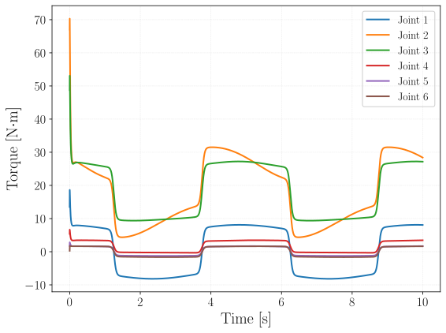
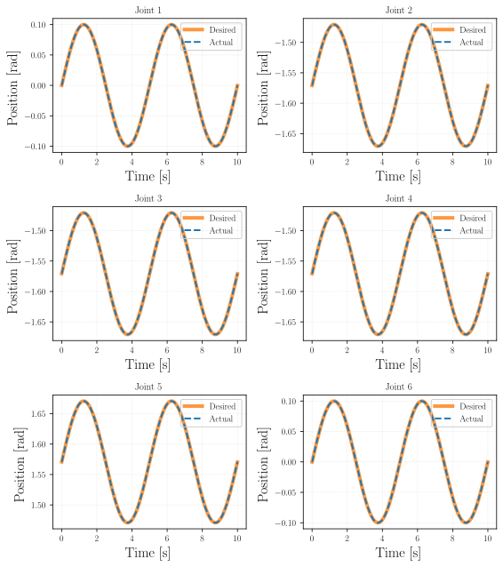

.. _joint_space_motion_control:

**************************
Joint-space motion control
**************************
sdu_controllers implements a joint-space motion controller with inverse dynamics control,
which lets a robot follow an arbitrary joint-space trajectory within the robot's limits.
This page contains two examples, in the :ref:`first example <ur5e_joint_space_control>` we
use the Universal Robots UR5e 6 DOF robot manipulator and in the
:ref:`second example <bb_robot_joint_space_control>` the more advanced 7 DOF breeding
blanket handling robot.

.. seealso::
   :ref:`Joint-space (inverse dynamics) control <explanation-joint-space>` for the theory
   behind this controller, including the derivation of the control law and how the
   forward dynamics simulation used below works.

.. _ur5e_joint_space_control:

UR5e robot joint-space control
------------------------------
This example combines the three building blocks from :ref:`Getting started <getting-started>`:
a :code:`URRobotModel` of the UR5e, a :code:`PIDController`, and the sinusoidal reference
:math:`q_d(t) = q_0 + a\sin(\omega t)` evaluated inside the control loop. You can choose to
make your own example with a :code:`.cpp` or :code:`.py` file or simply use the one available under

:code:`examples/simulation/ur/cpp/joint_motion_controller.cpp`

or

:code:`examples/simulation/ur/python/joint_motion_controller.py`.

The code for joint-space motion control is listed here in C++ and Python:

.. tabs::

   .. code-tab:: c++

        #include <Eigen/Dense>
        #include <cmath>
        #include <sdu_controllers/controllers/pid_controller.hpp>
        #include <sdu_controllers/models/ur_robot_model.hpp>

        constexpr double pi = 3.14159265358979323846;

        // Initialize robot model and parameters
        auto robot_model = std::make_shared<models::URRobotModel>(models::URRobotModel::RobotType::ur5e);
        double dt = 1.0 / 500.0;
        double Kp_val = 1000.0; // Proportional gain
        double Kd_val = 2 * sqrt(Kp_val); // Derivative gain
        double N_val = 1; // Feed-forward gain
        uint16_t ROBOT_DOF = robot_model->get_dof();
        VectorXd Kp_vec = VectorXd::Ones(ROBOT_DOF) * Kp_val;
        VectorXd Kd_vec = VectorXd::Ones(ROBOT_DOF) * Kd_val;
        VectorXd N_vec = VectorXd::Ones(ROBOT_DOF) * N_val;

        VectorXd u_max(ROBOT_DOF);
        u_max << 150.0, 150.0, 150.0, 28.0, 28.0, 28.0;
        controllers::PIDController pid_controller(Kp_vec.asDiagonal(), VectorXd::Zero(ROBOT_DOF).asDiagonal(),
          Kd_vec.asDiagonal(), N_vec.asDiagonal(), dt, -u_max, u_max);

        // Sinusoidal joint trajectory parameters
        VectorXd q0(ROBOT_DOF);
        q0 << 0.0, -1.5707, -1.5707, -1.5707, 1.5707, 0.0;
        double amplitude = 0.2; // [rad]
        double omega = 2.0 * pi * 0.1; // [rad/s], 0.1 Hz

        VectorXd q = q0;
        VectorXd dq = VectorXd::Zero(ROBOT_DOF);
        Vector<double, 6> he = VectorXd::Zero(6);

        // Control loop
        for (size_t step = 0; step < num_steps; step++)
        {
          double t = step * dt;

          // Desired
          VectorXd q_d = (q0.array() + amplitude * std::sin(omega * t)).matrix();
          VectorXd dq_d = VectorXd::Ones(ROBOT_DOF) * (amplitude * omega * std::cos(omega * t));
          VectorXd ddq_d = VectorXd::Ones(ROBOT_DOF) * (-amplitude * omega * omega * std::sin(omega * t));

          // Controller
          VectorXd u_ff = ddq_d; // acceleration as feedforward.
          // VectorXd u_ff = robot_model->get_gravity(q); // feedforward with gravity compensation.
          pid_controller.step(q_d, dq_d, u_ff, q, dq);
          VectorXd y = pid_controller.get_output();
          VectorXd tau = robot_model->inverse_dynamics(q, dq, y, he);
          std::cout << "tau: " << tau << std::endl;
        }

   .. code-tab:: py

        import numpy as np
        import sdu_controllers

        PI = 3.14159265358979323846

        dt = 1.0 / 500.0
        Kp_val = 1000.0  # Proportional gain
        Kd_val = 2 * np.sqrt(Kp_val)  # Derivative gain
        N_val = 1  # Feed-forward gain

        robot_model = sdu_controllers.models.URRobotModel(sdu_controllers.models.RobotType.ur5e)
        dof = robot_model.get_dof()

        Kp = np.eye(dof) * Kp_val
        Kd = np.eye(dof) * Kd_val
        N = np.eye(dof) * N_val
        u_max = np.array([150.0, 150.0, 150.0, 28.0, 28.0, 28.0])

        pid_controller = sdu_controllers.controllers.PIDController(Kp, np.zeros((dof, dof)), Kd, N, dt, -u_max, u_max)

        # Sinusoidal joint trajectory parameters
        q0 = np.array([0.0, -1.5707, -1.5707, -1.5707, 1.5707, 0.0])
        amplitude = 0.2  # [rad]
        omega = 2.0 * PI * 0.1  # [rad/s], 0.1 Hz

        q = q0.copy()
        dq = np.zeros(dof)
        he = np.zeros(6)

        for step in range(num_steps):
            t = step * dt

            q_d = q0 + amplitude * np.sin(omega * t)
            dq_d = np.full(dof, amplitude * omega * np.cos(omega * t))
            ddq_d = np.full(dof, -amplitude * omega * omega * np.sin(omega * t))

            u_ff = ddq_d
            # u_ff = robot_model.get_gravity(q)  # feedforward with gravity compensation.
            pid_controller.step(q_d, dq_d, u_ff, q, dq)
            y = pid_controller.get_output()
            tau = robot_model.inverse_dynamics(q, dq, y, he)
            print('tau:', tau)

You have to provide gains for the PID controller using the variables :code:`Kp_val` and
:code:`Kd_val`, and optionally a feed-forward gain using the variable :code:`N_val`. The
amplitude and frequency of the sinusoid (:code:`amplitude` and the :code:`0.1` Hz used in
:code:`omega`) can be tuned to make the tracking test more or less demanding.

If you plot the output joint torques from the variable :code:`tau`, you should get something similar
to the following figure:

To check whether the output torques produce a robot movement that tracks the sinusoidal
reference, the example scripts also simulate the resulting motion using forward dynamics
and compare it against :math:`q_d(t)`; see
:ref:`Joint-space (inverse dynamics) control <explanation-joint-space>` for details on how
this simulation works. In the following figure you can see the comparison of :math:`q` and :math:`q_d`.

.. _bb_robot_joint_space_control:

Breeding blanket handling robot joint-space control
---------------------------------------------------

.. tabs::

   .. code-tab:: c++

         int main(const int argc, const char **argv) {
           return 0;
         }

   .. code-tab:: py

         def main():
             return

see additional examples in the :ref:`Examples <examples>` section.

